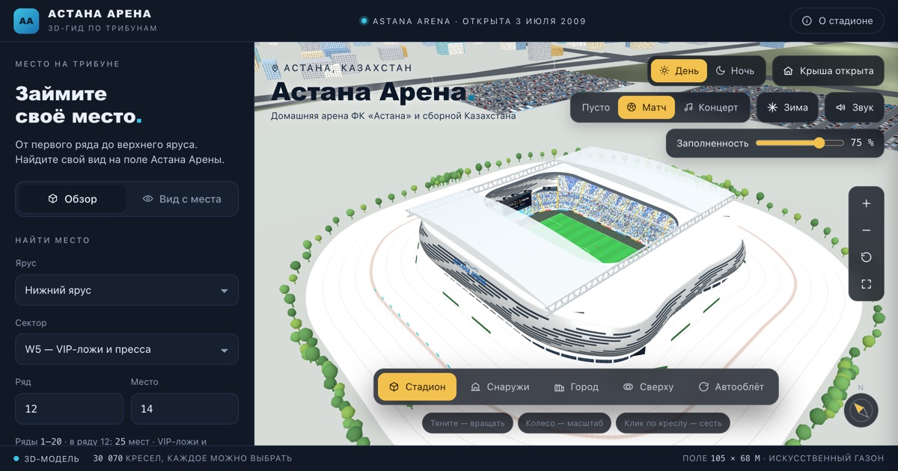
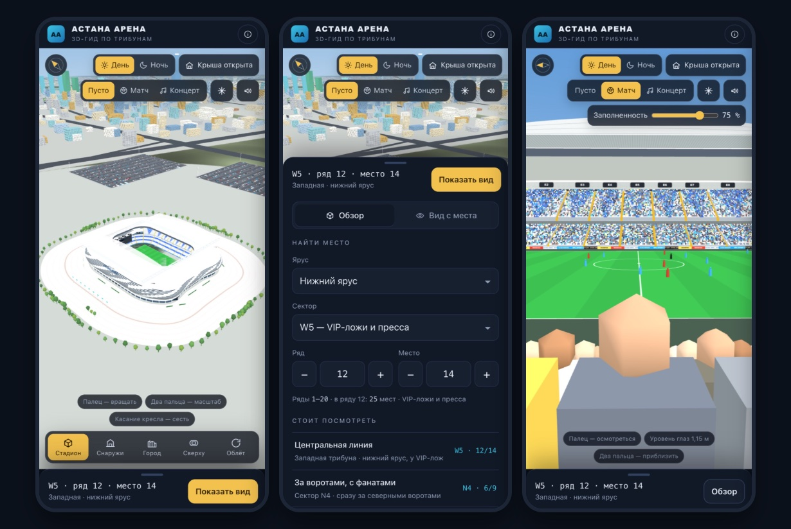

# Астана Арена 3D

Интерактивная 3D-модель стадиона «Астана Арена» в браузере: выберите ярус, сектор, ряд и место и посмотрите на поле со своего кресла.

**Открыть:** https://dezdoss.github.io/astana-arena/



На телефоне сцена занимает весь экран, а выбор места живёт в выдвижной нижней панели:



## Что умеет

- **Выбор места.** Форма «ярус, сектор, ряд, место» или клик по любому из 30 070 кресел прямо в 3D.
- **Вид с кресла.** Камера садится на выбранное место на уровне глаз, можно осмотреться и приблизить.
- **Камеры.** Стадион, снаружи, город, сверху, автооблёт.
- **Атмосфера.** День и ночь, раздвижная крыша, матч-день с болельщиками и табло, концерт со сценой, зима, шум трибун.
- **Телефоны и планшеты.** Нижняя панель выбора места, кнопки «−» и «+» для ряда и места, жесты одним и двумя пальцами, альбомная ориентация.
- **Город вокруг.** Стилизованная Астана: Есиль, бульвар Нуржол, Байтерек, Хан Шатыр, Нур Алем, Ак Орда и другие доминанты на своих местах относительно арены.

## Управление

| Действие | Мышь | Сенсорный экран |
| --- | --- | --- |
| Вращать, осмотреться | тянуть | тянуть одним пальцем |
| Масштаб | колесо | щипок |
| Сесть на место | клик по креслу | касание кресла |
| Вернуться в обзор | Esc или кнопка «Обзор» | кнопка «Обзор» |

## Как устроено

Один файл `index.html` без сборки и сервера. [Three.js](https://threejs.org/) r128 подгружается с cdnjs, шрифты с Google Fonts. Геометрия чаши, фасада и города строится процедурно при загрузке, кресла и здания рисуются инстансами.

Локальный запуск:

```bash
python3 -m http.server 8000
```

Затем открыть http://localhost:8000.

### Производительность

Кресла и болельщики разбиты на куски «сектор + ярус» с тремя уровнями детализации. Ближние куски рисуются подробно, дальние упрощённо, куски вне кадра отсекаются, а изнутри чаши город не рисуется совсем.

На телефонах дополнительно включается облегчённый режим: упрощённые материалы и меньшее разрешение рендера. Если кадры идут медленно, разрешение снижается само.

| Параметр адреса | Что делает |
| --- | --- |
| `?lite=1` | принудительно включить облегчённый режим |
| `?lite=0` | принудительно выключить его |
| `?debug=1` | открыть внутреннее состояние в `window.__arena` для тестов |

## Проверка

В `tools/check.mjs` лежит автопроверка: headless Chrome эмулирует телефоны, планшет и десктоп, шлёт настоящие touch-события и сверяет вёрстку, жесты, нижнюю панель и вид с места.

```bash
python3 -m http.server 8791 --bind 127.0.0.1
```

```bash
node tools/check.mjs
```

## Оговорки

Это неофициальный фан-проект. Он не связан с администрацией стадиона, ФК «Астана» и билетными операторами.

Схема секторов, число рядов и кресел, детали фасада и застройка города собраны по открытым данным и фотографиям и являются приближённой реконструкцией. Перед покупкой билета сверяйтесь с официальной схемой зала.
